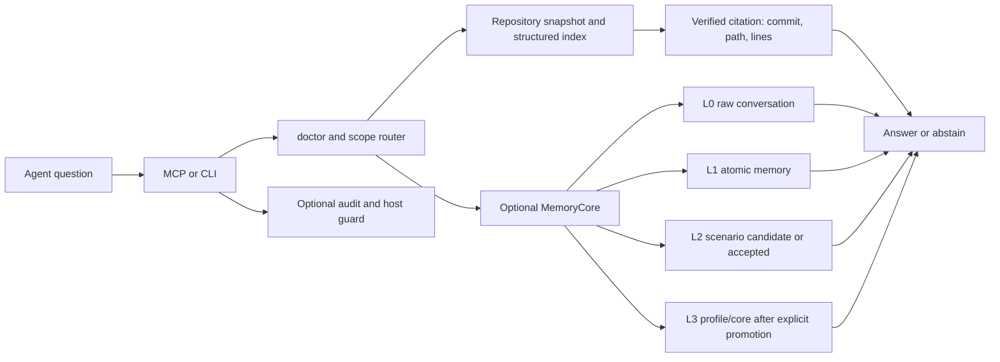

# Repository Memory

Repository Memory is a small, source-backed memory layer for AI agents.
It gives an agent one consistent way to answer questions about project
documents, research notes, reports, source-code evidence, and explicitly
imported conversation memory.

The important idea is simple:

> An answer is a fact only when the runtime can show where it came from.

It ships as one generic Skill with a shared Python runtime:

- a citation-first repository index and CLI;
- a local stdio MCP server for Claude, Codex, OpenClaw, and other hosts;
- an optional MemoryCore adapter for L0-L3 conversation memory;
- an optional OpenClaw lifecycle extension for conservative post-turn capture;
- a metadata-only audit proxy and an optional guard that audits by default and
  can block direct-file bypasses in explicit enforcement mode.

The repository itself is the source of truth. Indexes, snapshots, audit logs,
conversation data, and credentials stay in user-level data/config/cache
directories and are never written back to the source repository by search or
sync.

## What happens on one question?



`scope=repository` searches Git-backed evidence only. `scope=memory` searches
the configured conversation-memory plane. `scope=all` returns two separate
groups; it never fuses scores or turns a conversation into a Git citation.

## Install

Requirements: Python 3.10+ and Git. The core runtime uses only the Python
standard library. Node.js is needed only for the OpenClaw extension tests or
when OpenClaw itself requires it.

```bash
git clone https://github.com/LeslieWylie/repository-memory.git
cd repository-memory

# Install the Skill, CLI, MCP registration, and (when OpenClaw is configured)
# the profile-local lifecycle extension.
python3 install.py --all --source-root /path/to/knowledge-repository --json
```

For a single host:

```bash
python3 install.py --target codex --source-root /path/to/knowledge-repository --json
python3 install.py --target claude --source-root /path/to/knowledge-repository --json
python3 install.py --target openclaw --openclaw-config /path/to/openclaw.json \
  --source-root /path/to/knowledge-repository --json
```

The installer makes a timestamped backup before changing a host config. It
does not push, commit, pull, or rewrite the knowledge repository.

## First check

After installation, run the bundled executable or the generated user-level
command:

```bash
repository-memory doctor --json
repository-memory search "the question in the user's own words" \
  --scope repository --json
```

With OpenClaw, verify the registered server through the host rather than
trusting a model-written receipt:

```bash
openclaw mcp probe repository-memory
```

A healthy repository setup reports an indexed commit, a non-stale source, and
results containing a valid `citation`. If the source is missing, stale, dirty,
or the citation cannot be checked, the result stays in `candidates` or the
runtime returns `abstain=true`.

## Result rules

Every search response has two layers:

- `verified`: the runtime resolved the source, commit, path, line range, and
  excerpt, and no disqualifying status was found;
- `candidates`: related or incomplete material, including stale, generated,
  inferred, pending, dirty, or citation-incomplete results.

Agents should answer from `verified` only. A document-level verified result
does not prove every part of a compound claim. Check `support.claim_support`
and use `get` or `explain` for the full evidence window before making a claim
marked `partial` or `unknown`.

The runtime does not require embeddings. When no semantic provider is
configured, doctor and search say `retrieval_mode=lexical` and
`semantic_available=false`; this is a supported fallback, not a hidden
semantic claim. No black-box cross-backend RRF is used.

## Four memory layers

The optional MemoryCore adapter keeps conversation memory distinct from
repository evidence:

| Layer | Meaning | Default write policy |
| --- | --- | --- |
| L0 | Raw conversation/message | Explicit ingest or opt-in host capture; read-back required |
| L1 | Atomic fact extracted from conversation | Pending until extraction/read-back is observed |
| L2 | Scenario or generated long-term context | Candidate/pending until review |
| L3 | Stable profile/core memory | Explicit promotion and read-back only |

An API being reachable is not the same as having useful data. Doctor reports
capability, reachability, record counts, pending candidates, and read-back
verification separately.

MemoryCore is optional and is not bundled in this repository. Its endpoint,
model, provider, and credentials are discovered from user configuration or
environment at runtime. Credentials are never committed to Git. If it is not
available, repository search still works and explicit session ingest can use
the conservative local fallback with clearly reported layer support.

## MCP

The server uses local stdio and supports the modern MCP discovery/metadata
path first, while retaining a small compatibility handshake for hosts that
have not migrated yet. Current tool names are:

```text
memory_doctor
memory_sync
memory_search
memory_get
memory_init       # explicit source setup
memory_ingest     # explicit write
```

The MCP and CLI call the same runtime and return the same JSON contract. The
server is not bound to a port.

## OpenClaw capture and guard

The OpenClaw extension is optional. It can:

1. require the repository-memory MCP route for project-fact turns;
2. audit the bare built-in memory tool and direct-file fallback by default, or
   block them when explicit enforcement mode is enabled;
3. audit tool metadata without storing full prompts or answers;
4. capture bounded user/assistant text after a completed turn into L0;
5. leave L2 as a reviewable candidate and never write L3 automatically.

Normal coding tasks remain free to use the host's normal tools. A host without
tool lifecycle hooks can still use the Skill/MCP contract, but cannot claim
that direct-file access is technically blocked.

## Public boundary

This project contains generic runtime code, fixtures, and documentation only.
It intentionally does not contain private repositories, organization-specific
evaluation sets, credentials, model names, internal hostnames, or user data.
Use `memory_init`/`source add` to attach the repositories that are appropriate
for your own environment.

See [docs/quickstart.md](docs/quickstart.md),
[docs/architecture.md](docs/architecture.md), and
[docs/troubleshooting.md](docs/troubleshooting.md).

## License

MIT. See [LICENSE](LICENSE).
