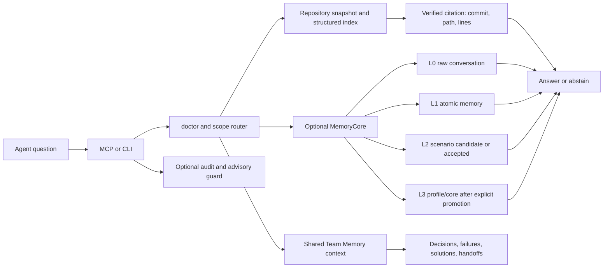

# Repository Memory

Repository Memory is a small, source-backed memory layer for AI agents.
It gives an agent one consistent way to answer questions about project
documents, research notes, reports, source-code evidence, and explicitly
imported conversation memory.

The important idea is simple:

> An answer is a fact only when the runtime can show where it came from.

It ships as one generic Skill with a shared Python runtime and a pinned,
source-only TencentDB component snapshot:

- a citation-first repository index and CLI;
- a local stdio MCP server for Claude, Codex, OpenClaw, and other hosts;
- a MemoryCore adapter for L0-L3 conversation memory;
- an OpenClaw lifecycle extension for before-prompt recall and conservative post-turn capture;
- a metadata-only audit proxy and an advisory guard that validates evidence
  receipts without blocking normal coding, shell, Git, or debugging tools.

The mainline is citation-first repository retrieval. An optional user-level
Team Memory plane can store compact decisions, failures, discoveries, solutions,
and handoffs, but it remains separate from Git citations and is never required
for repository search.

The repository itself is the source of truth. Indexes, snapshots, audit logs,
conversation data, and credentials stay in user-level data/config/cache
directories and are never written back to the source repository by search or
sync.

## What happens on one question?



`scope=repository` searches Git-backed evidence only. `scope=memory` searches
the configured conversation-memory plane. `scope=all` returns two separate
groups; it never fuses scores or turns a conversation into a Git citation.
For multi-agent work, the CLI `memory_context` command can package repository
evidence and Team Memory sections together without making experience look like
a Git citation. The public MCP surface remains deliberately read-only and uses
`memory_search` with an explicit `scope` when native memory is needed.

## Install

Requirements: Python 3.10+ and Git. The core runtime uses only the Python
standard library. Node.js is needed only for the OpenClaw extension tests or
when OpenClaw itself requires it.

```bash
git clone https://github.com/LeslieWylie/repository-memory.git
cd repository-memory

# Install the Skill, CLI, MCP registration, and (when OpenClaw is configured)
# the profile-local lifecycle extension.
python3 install.py --all --openclaw-agent <agent-id> \
  --source-root /path/to/knowledge-repository --json
```

For a single host:

```bash
python3 install.py --target codex --source-root /path/to/knowledge-repository --json
python3 install.py --target claude --source-root /path/to/knowledge-repository --json
python3 install.py --target openclaw --openclaw-config /path/to/openclaw.json \
  --openclaw-agent <agent-id> \
  --source-root /path/to/knowledge-repository --json
```

OpenClaw installation is least-privilege by default: `--openclaw-agent` is
required and only that agent receives the Skill, MCP tool permissions, and
automatic capture. Use `--openclaw-agent` repeatedly for a selected set. The
all-agent behavior is available only through the explicit
`--openclaw-all-agents` flag.

The installer makes a timestamped backup before changing a host config. It
does not push, commit, pull, or rewrite the knowledge repository.

## First check

After installation, run the bundled executable or the generated user-level
command:

```bash
repository-memory doctor --json
repository-memory search "the question in the user's own words" \
  --scope repository --json
```

With OpenClaw, verify the registered server through the host rather than
trusting a model-written receipt:

```bash
openclaw mcp probe repository-memory
```

A healthy repository setup reports an indexed commit, a non-stale source, and
results containing a valid `citation`. If the source is missing, stale, dirty,
or the citation cannot be checked, the result stays in `candidates` or the
runtime returns `abstain=true`.

## Result rules

Every search response has two layers:

- `verified`: the runtime resolved the source, commit, path, line range, and
  excerpt, and no disqualifying status was found;
- `candidates`: related or incomplete material, including stale, generated,
  inferred, pending, dirty, or citation-incomplete results.

Agents should answer from `answerable` (also returned as `results`) only.
`verified` is the document-retrieval/evaluation lane: it proves that a citation
is real, not that one excerpt supports every part of a compound claim. If
`verified` is populated but `answerable` is empty, the runtime must abstain or
narrow the answer. Check `support.claim_support` and use `get` or `explain`
with the returned commit and line range before making a claim marked
`partial` or `unknown`.

The runtime does not require embeddings. When no semantic provider is
configured, doctor and search say `retrieval_mode=keyword-only` and
`semantic_available=false`; this is a supported fallback, not a hidden
semantic claim. `scope=all` returns repository and MemoryCore lanes in separate
groups. No black-box cross-backend RRF is used.

## Shared Team Memory

The explicit Team Memory tools are:

```text
memory_context     # task-start hydration
memory_publish     # explicit decision/failure/solution/handoff write
memory_feedback    # helpful/not_helpful/stale/wrong reuse feedback
memory_supersede   # explicit correction and lifecycle transition
memory_team_activate # explicit candidate review -> active
```

Records use the lifecycle `candidate -> active -> superseded|stale` and are
stored in a user-level SQLite cache. SQLite is the default backend behind a
`TeamMemoryBackend` seam; it uses WAL, a bounded busy timeout, and retryable
transactions for concurrent local agents. Records contain `type`, `scope`,
`provenance`, `confidence`, `author_agent`, validity windows, and reuse
feedback plus causal `revision`, `origin_node`, and `parent_revision` fields.
Reviews are recorded separately as `reviewed_by`/`activated_at`; they never
overwrite `author_agent`. Bundle schema 3 carries an append-only revision log,
so a receiver can fast-forward from an older known ancestor even when it
missed intermediate exports. Concurrent branches are reported as conflicts
instead of being resolved by wall-clock time. They are not a second Git
repository and are never written into the
canonical source tree.

For cross-machine or container handoff, use an explicit portable bundle:

```bash
repository-memory team-export --output /tmp/team-memory.json --json
repository-memory team-import --input /tmp/team-memory.json --json
```

The bundle merge is idempotent and reports inserts, updates, conflicts, and
feedback additions. This is explicit file-based synchronization; the public
runtime does not pretend to provide a hosted Team Memory service.

## Four memory layers

The optional MemoryCore adapter keeps conversation memory distinct from
repository evidence:

| Layer | Meaning | Default write policy |
| --- | --- | --- |
| L0 | Raw conversation/message | Explicit ingest or opt-in host capture; read-back required |
| L1 | Atomic fact extracted from conversation | Pending until extraction/read-back is observed |
| L2 | Scenario or generated long-term context | Candidate/pending until review |
| L3 | Stable profile/core memory | Explicit promotion and read-back only |

An API being reachable is not the same as having useful data. Doctor reports
capability, reachability, record counts, pending candidates, and read-back
verification separately. Every `memory.layers.L*` entry uses the same four-way
contract: `capability`, `api_status`, `population`, and `readback`. Population
is only `present` when the layer's actual query/read response returns records
or content; unsupported, unreachable, malformed, or unprobed states remain
`unknown` rather than being inferred from global health.

The repository bundles a clean source snapshot of upstream MemoryCore and
MemoryKnowledge components under the Skill's `vendor/` directory. The Python
adapter still owns the public JSON contract and citations, but the installed
MemoryCore service can run directly from that clean snapshot: it installs the
runtime dependencies into the user data directory, applies the small
repository-memory isolation/L3 policy patch there, and never mutates the Git
vendor snapshot or an unrelated dirty checkout. The manifest pins the modules
used for L0 capture, L1 extraction, L2 navigation, L3 profile recall, and
Wiki/code-graph adapter design.

The live MemoryCore endpoint, model, provider, and credentials are discovered
from user configuration or environment at runtime. Credentials are never
committed to Git. If the service is unavailable, repository search still works
and explicit session ingest uses the conservative local fallback with clearly
reported layer support. `doctor --json` reports the actual runtime root and
process so a vendored service cannot be confused with an external checkout.

## MCP

The server uses local stdio and advertises the modern MCP discovery/metadata
path first, while retaining a small compatibility handshake for hosts that
have not migrated yet. The public tool list is intentionally limited to
read/diagnostic operations:

```text
memory_doctor
memory_sync
memory_search
memory_get
```

Use the CLI for `init`, `source add`, `ingest-session`, `feedback`, Team Memory
publish/activate, and `memorycore promote-l3`. The MCP and CLI share the same
runtime and return the same read/query contract; the server is not bound to a
port.

## OpenClaw capture and guard

The OpenClaw extension is optional. It can:

1. observe whether project-fact turns use the repository-memory MCP route;
2. audit the bare built-in memory tool and direct-file fallback without
   blocking normal tool use;
3. audit tool metadata without storing full prompts or answers;
4. capture bounded user/assistant text after a completed turn into L0;
5. leave L2 as a reviewable candidate and never write L3 automatically.

Normal coding, testing, build, shell, Git-status, and patch tasks remain free to use
the host's normal tools. A host without
tool lifecycle hooks can still use the Skill/MCP contract, but cannot claim
that direct-file access is technically blocked.

## Public boundary

This project contains generic runtime code, fixtures, and documentation only.
It intentionally does not contain private repositories, organization-specific
evaluation sets, credentials, model names, internal hostnames, or user data.
Use `init`/`source add` to attach the repositories that are appropriate
for your own environment.

See [docs/quickstart.md](docs/quickstart.md),
[docs/architecture.md](docs/architecture.md), and
[docs/troubleshooting.md](docs/troubleshooting.md).

Project maintenance and release boundaries are documented in
[CONTRIBUTING.md](CONTRIBUTING.md), [SECURITY.md](SECURITY.md),
[CHANGELOG.md](CHANGELOG.md), and
[docs/compatibility.md](docs/compatibility.md). The privacy-free public
retrieval regression set lives in [eval/public](eval/public/README.md).

## License

MIT. See [LICENSE](LICENSE).
