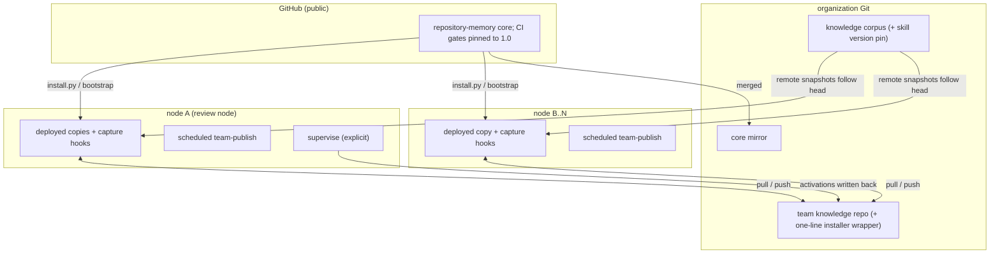

# System lifecycle and UML

Four diagrams and one table: how a question is answered, how a piece of team
knowledge lives, and how the fleet stays in sync. GitHub renders the Mermaid
blocks inline.

## Components

```mermaid
flowchart LR
    subgraph Hosts["Hosts (any AI harness)"]
        CC["Claude Code"]
        CX["Codex"]
        OC["OpenClaw agents"]
        ANY["anything else"]
    end
    subgraph Doors["Four doors, one contract"]
        SKILL["SKILL.md usage contract"]
        MCP["audited stdio MCP (2026-07-28)"]
        NATIVE["native repository_memory_* tools + agent_end capture hook"]
        CLI["CLI search/get/doctor/team-* --json"]
    end
    subgraph Core["Core runtime (zero dependencies)"]
        TOK["one query tokenizer (optional jieba / builtin n-gram)"]
        SEARCH["core.search: three planes in parallel + claim gate"]
        CIT["citation read-back: pinned / worktree"]
        SUP["supervisor review (gateway model, explicit)"]
    end
    subgraph Stores["Three memory planes"]
        REPO["repository plane: snapshot + lexical index + vectors, cached per commit"]
        MEM["local memory L0-L3: SQLite + FTS5"]
        TEAM["team memory: SQLite mirrored to a canonical Git repo"]
    end
    subgraph Ext["External"]
        CORPUS["knowledge Git repository"]
        TKD["team knowledge Git repository"]
        GW["optional OpenAI-compatible /embeddings endpoint"]
        GH["public core on GitHub (bootstrap installs)"]
    end
    CC & CX --> SKILL & MCP
    OC --> NATIVE
    ANY --> CLI & MCP
    SKILL -.guides.- MCP & NATIVE & CLI
    MCP & NATIVE & CLI --> SEARCH
    SEARCH --> TOK
    SEARCH --> REPO & MEM & TEAM
    SEARCH --> CIT
    SUP --> TEAM
    REPO <-->|fetch + forced checkout + integrity check| CORPUS
    TEAM <-->|team-publish: pull / export / commit / push| TKD
    REPO & MEM -.optional vectors.-> GW
    GH -.install.py / bootstrap.-> Doors
```

## A team record's state machine

```mermaid
stateDiagram-v2
    [*] --> L0_turn: agent_end hook captures; write is read back
    L0_turn --> L1_atomic: automatic extraction
    L1_atomic --> LocalCandidate: team candidate; stamped agent/run/observed_at
    LocalCandidate --> InboxFile: team-publish exports one md per record; filename = content hash
    InboxFile --> HydratedCandidate: other nodes pull + hydrate (idempotent)
    HydratedCandidate --> UnderReview: supervise --apply (explicit)
    UnderReview --> Active: hard checks (no secrets / content / traceable) + model accept + confidence >= 0.7; reviewer stamped
    UnderReview --> StillCandidate: hold or reject; verdict and reason in receipts
    Active --> ActiveFile: next publish moves inbox -> l1/active (lifecycle = a git move)
    ActiveFile --> Answerable_everywhere: every node hydrates it active
    Active --> Superseded: explicitly replaced
    Active --> Stale: validity window expired
    InboxFile --> Quarantined: same id, different content -> conflicts/ awaits a human
    StillCandidate --> UnderReview: next review round
```



## One query

```mermaid
sequenceDiagram
    participant U as host model
    participant D as door (MCP / native / CLI)
    participant S as core.search (scope=auto)
    participant R as repository plane
    participant M as local memory
    participant T as team memory
    U->>D: memory_search(user words, verbatim)
    D->>S: tokenize (closed-class scaffolding dropped, dates normalized, joins marked)
    par three planes
        S->>R: snapshot forced-checkout + verify; lexical + semantic; heading-anchored window
        R-->>S: verified + claim support + citation
        S->>M: L0-L3 search (query echoes dropped)
        M-->>S: answerable (assistant turns admitted at partial)
        S->>T: match active records
        T-->>S: each carries claim support
    end
    S->>S: claim gate: only direct support answers; joins never gate; framing nouns cannot carry a claim alone
    S-->>D: results/answerable + groups + answered_by; abstain = repository plane holds no evidence
    D-->>U: cited answer (commit+lines) or an explicit abstention; team records labelled as experience
    opt compound or important claims
        U->>D: memory_get(id, commit, lines)
        D-->>U: exact evidence window, read back; pinned=false is attributed to the working tree
    end
```

## Fleet topology



## Ten lifecycle phases

| Phase | Trigger | Guarantee |
|---|---|---|
| 1 install | one command (bootstrap / wrapper) | writes user dirs only; receipt must say doctor+mcp ready |
| 2 register source | `--source-url` / `init` | snapshots isolated from worktrees; canonical repo never written |
| 3 index | first query / sync, cached per commit | torn checkouts self-repair (force + verify); vector caches used only on signature match |
| 4 query | one `memory_search` call | planes kept separate; claim gate; `answered_by` names who answered |
| 5 cite | citation read-back | pinned vs worktree distinguished; `get` re-verifies independently |
| 6 capture | `agent_end` hook (automatic) | L0 read back; candidates never answer |
| 7 publish | scheduled `team-publish` | stages only `knowledge/`; git identity preflighted; failures name their file |
| 8 review | `supervise` (explicit) | hard checks + model + confidence; receipts; every projection transitions together |
| 9 distribute | publish's git move + node pulls | lifecycle is a file move with git history |
| 10 gate | CI on every push | P@1 / R@5 / negative abstention / citation parseability pinned at 1.0 |

One line runs through all ten: **an answer carries its receipt, or the system
says it has none.**
